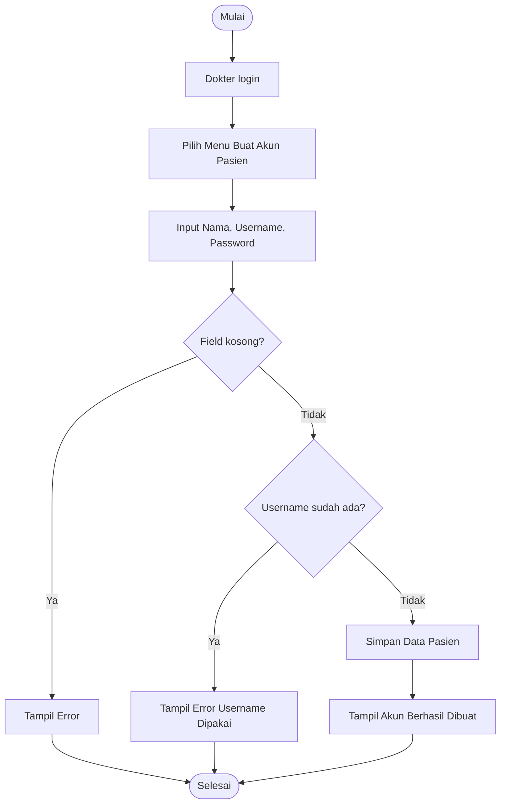
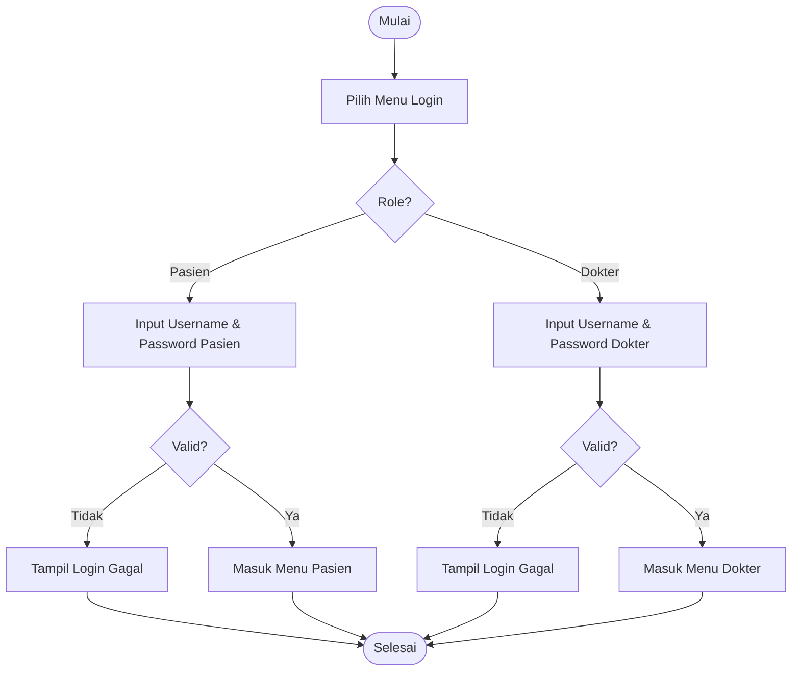

# Perancangan Aplikasi Monitoring dan Journaling Tidur

## Judul Proyek
**Perancangan Aplikasi Monitoring dan Journaling Tidur Menggunakan Instrumen Sleep Diary berdasarkan AASM Berbasis C++**

## Tim Pengembang
**Nama Tim:** Orang-Orang Insom

| NIM        | Nama                         |
| ---------- | ---------------------------- |
| 2509106045 | ATHASYAHRI SYAWAL FAHREZY    |
| 2509106040 | MUTIA RAHMAH                 |
| 2509106026 | MUHAMMAD ALI FATHAN RAMADHAN |

## Deskripsi Singkat
Proyek ini berfokus pada perancangan aplikasi monitoring dan journaling tidur berbasis **C++** dengan pendekatan **Sleep Diary** berdasarkan pedoman **AASM (American Academy of Sleep Medicine)**.

Aplikasi dirancang untuk membantu pengguna mencatat pola tidur harian, memantau kebiasaan tidur, serta mengevaluasi kualitas tidur secara terstruktur.

## Tujuan
- Menyediakan media pencatatan tidur harian yang sistematis.
- Membantu pengguna memahami pola tidur pribadi.
- Mendukung evaluasi kualitas tidur berdasarkan instrumen Sleep Diary AASM.

## Teknologi
- Bahasa pemrograman: **C++**
- Platform: **Console Application**
- Metode pencatatan: **Sleep Diary (AASM)**
- Penyimpanan data sementara: **File TXT** di folder `data/`

## Struktur Kode (Modular)
- `main.cpp`: entry point aplikasi (tetap di root).
- `include/`: header project (`app.h`, `user.h`, `menus.h`, `data_store.h`, `auth/auth.h`).
- `src/`: source utama (`app.cpp`, `menus.cpp`, `data_store.cpp`, `auth/auth.cpp`, `pasien/read.cpp`).
- `data/`: data TXT (`users.txt`, `sleep_records.txt`).
- `bin/`: output executable.
- `misc/`: file pendukung/non-utama.

## Format Data User (TXT)
File `data/users.txt` menggunakan format per baris:

`nama|username|password`

Contoh:

`Andi Saputra|andi|123`

## Periode Pengerjaan
**27 April 2026 - 9 Mei 2026**

## Konsep Sistem
Aplikasi berbasis C++ console dengan 2 role:

1. **Pasien/User**: mengisi jurnal malam, input data tidur setelah bangun, melihat dan mengelola data tidur sendiri.
2. **Dokter**: memantau data pasien, melihat hasil sleep diary pasien, dan mengelola data bila diperlukan.

## Gambaran Fitur Utama
### Role Pasien/User
- Akun dibuat oleh dokter
- Login
- Isi jurnal malam
- Simpan jam mulai sesi malam otomatis
- Input data setelah bangun
- Hitung indikator sleep diary
- Lihat riwayat tidur
- Edit data tidur
- Hapus data tidur

### Role Dokter
- Login
- Lihat daftar pasien
- Lihat data tidur pasien
- Lihat indikator hasil pasien
- Lihat ringkasan sederhana pasien
- Hapus data pasien bila diperlukan

## Indikator yang Dihitung
- **SOL** = jam mulai tidur final - jam mulai sesi malam
- **WASO** = total lama terjaga malam hari
- **Number of Awakenings**
- **TST** = jam bangun - jam mulai tidur final - WASO
- **SE** = TST / waktu di tempat tidur x 100%

## Roadmap Full Per Fitur

### Fitur 1 - Analisis sistem, role, flowchart dasar, dan struktur data
**Target: 27 April 2026**

**Tujuan**  
Menentukan fondasi aplikasi sebelum coding.

**Yang dikerjakan**
- Finalisasi judul project
- Finalisasi konsep aplikasi
- Finalisasi 2 role:
  - Pasien/User
  - Dokter
- Finalisasi input sebelum tidur
- Finalisasi input setelah bangun
- Finalisasi output yang dihitung
- Buat flowchart umum sistem
- Buat flowchart login dan pembagian role
- Rancang struktur data:
  - User
  - Dokter
  - SleepRecord
- Tentukan penyimpanan data: vector / file text

**Hasil akhir**
- Konsep final sistem
- Flowchart dasar
- Rancangan struktur data

### Fitur 2 - Login role dan pembuatan akun pasien oleh dokter
**Target: 28 April 2026**

**Tujuan**  
Pasien dan dokter bisa masuk ke sistem, serta dokter bisa membuat akun pasien.

**Yang dikerjakan**
- Buat flowchart pembuatan akun pasien oleh dokter
- Buat flowchart login
- Coding pembuatan akun pasien oleh dokter
- Coding login pasien
- Coding login dokter
- Coding data dokter default
- Coding pembeda menu pasien dan menu dokter
- Testing login berhasil/gagal
- Testing navigasi menu

**Hasil akhir**
- Pembuatan akun pasien oleh dokter berjalan
- Login pasien dan dokter jalan
- Menu role terpisah

**Flowchart Pembuatan Akun Pasien (Oleh Dokter)**

**Flowchart Login & Pembagian Role**

### Fitur 3 - Journaling malam pasien
**Target: 29 April 2026**

**Tujuan**  
Pasien bisa mengisi jurnal malam dan sistem menyimpan jam mulai sesi malam otomatis.

**Yang dikerjakan**
- Buat flowchart journaling malam
- Coding menu journaling malam
- Input jurnal malam
- Simpan jam mulai sesi malam otomatis
- Hubungkan record ke pasien yang login
- Testing penyimpanan data malam

**Hasil akhir**
- Pasien bisa isi jurnal malam
- Jam mulai sesi malam tersimpan otomatis

### Fitur 4 - Input data tidur setelah bangun
**Target: 30 April 2026**

**Tujuan**  
Pasien bisa melengkapi data tidur pagi hari.

**Input fitur**
- Jam mulai tidur final
- Jam bangun
- Jumlah terbangun
- Total lama terjaga malam hari
- Kualitas tidur
- Kondisi saat bangun

**Yang dikerjakan**
- Buat flowchart input pagi
- Coding form input pagi
- Sambungkan data pagi dengan data malam
- Testing apakah data menjadi satu record lengkap

**Hasil akhir**
- Input pagi selesai
- Data pagi dan malam tergabung

### Fitur 5 - Perhitungan indikator sleep diary
**Target: 1 Mei 2026**

**Tujuan**  
Sistem dapat menghitung seluruh indikator utama.

**Yang dikerjakan**
- Buat flowchart perhitungan
- Coding konversi jam ke menit
- Coding fungsi hitung:
  - SOL
  - WASO
  - Number of Awakenings
  - TST
  - Waktu di tempat tidur
  - SE
- Testing dengan contoh manual
- Tampilkan hasil ke layar

**Hasil akhir**
- Semua indikator sleep diary berjalan

### Fitur 6 - Riwayat tidur pasien
**Target: 2 Mei 2026**

**Tujuan**  
Pasien bisa melihat semua data tidur miliknya.

**Yang dikerjakan**
- Buat flowchart lihat riwayat
- Coding daftar riwayat tidur per pasien
- Tampilkan data dasar dan hasil indikator
- Testing apakah hanya data pasien sendiri yang tampil

**Hasil akhir**
- Fitur lihat riwayat selesai

### Fitur 7 - Edit dan hapus data tidur pasien
**Target: 3 Mei 2026**

**Tujuan**  
Pasien bisa mengoreksi atau menghapus data tidur.

**Yang dikerjakan**
- Buat flowchart edit data
- Buat flowchart hapus data
- Coding edit record tidur
- Coding hapus record tidur
- Setelah edit, indikator dihitung ulang
- Testing update dan delete

**Hasil akhir**
- Pasien bisa edit dan hapus data tidur

### Fitur 8 - Menu utama dokter dan monitoring pasien
**Target: 4-5 Mei 2026**

**Tujuan**  
Dokter dapat melihat data pasien dan memantau hasilnya.

**Yang dikerjakan**
- Buat flowchart menu dokter
- Coding menu dokter
- Coding daftar pasien
- Coding pilih pasien tertentu
- Coding tampilan semua data tidur pasien
- Tampilkan indikator tiap record
- Tampilkan ringkasan sederhana pasien:
  - Rata-rata TST
  - Rata-rata SE
  - Rata-rata kualitas tidur
  - Frekuensi terbangun
- Coding hapus data pasien oleh dokter
- Testing monitoring pasien

**Hasil akhir**
- Dokter bisa memantau data pasien
- Dokter bisa lihat ringkasan pasien

### Fitur 9 - Validasi input dan perapihan sistem
**Target: 6 Mei 2026**

**Tujuan**  
Program lebih stabil dan aman dipakai.

**Yang dikerjakan**
- Validasi format jam
- Validasi angka
- Validasi jumlah terbangun
- Validasi lama terjaga
- Validasi login
- Rapikan menu dan output
- Tambah pesan kesalahan sederhana

**Hasil akhir**
- Sistem lebih stabil
- Error input berkurang

### Fitur 10 - Testing menyeluruh
**Target: 7 Mei 2026**

**Tujuan**  
Semua fitur diuji dari awal sampai akhir.

**Yang dikerjakan**
- Test registrasi
- Test login pasien
- Test login dokter
- Test journaling malam
- Test input pagi
- Test perhitungan indikator
- Test riwayat
- Test edit/hapus
- Test monitoring pasien
- Catat bug

**Hasil akhir**
- Daftar bug dan kekurangan

### Fitur 11 - Bug fixing dan finalisasi flowchart
**Target: 8 Mei 2026**

**Tujuan**  
Perbaiki bug utama dan siapkan dokumentasi presentasi.

**Yang dikerjakan**
- Perbaiki bug hasil testing
- Rapikan kode
- Finalisasi semua flowchart per fitur
- Siapkan ringkasan penjelasan sistem
- Siapkan skenario demo

**Hasil akhir**
- Sistem lebih siap
- Flowchart final selesai

### Fitur 12 - Final check dan siap presentasi
**Target: 9 Mei 2026**

**Tujuan**  
Project siap dikumpulkan dan dipresentasikan.

**Yang dikerjakan**
- Uji coba terakhir
- Cek seluruh menu
- Cek seluruh output
- Cek hak akses pasien/dokter
- Final check kode
- Siapkan file final

**Hasil akhir**
- Source code final
- Flowchart final
- Project siap presentasi

## Ringkasan Target Per Tanggal
| Tanggal       | Fitur    | Target utama                                                 |
| ------------- | -------- | ------------------------------------------------------------ |
| 27 April 2026 | Fitur 1  | Analisis sistem, flowchart dasar, struktur data             |
| 28 April 2026 | Fitur 2  | Login role dan pembuatan akun pasien oleh dokter            |
| 29 April 2026 | Fitur 3  | Journaling malam pasien                                     |
| 30 April 2026 | Fitur 4  | Input data setelah bangun                                   |
| 1 Mei 2026    | Fitur 5  | Perhitungan indikator sleep diary                           |
| 2 Mei 2026    | Fitur 6  | Riwayat tidur pasien                                        |
| 3 Mei 2026    | Fitur 7  | Edit dan hapus data tidur pasien                            |
| 4-5 Mei 2026  | Fitur 8  | Menu dokter dan monitoring pasien                            |
| 6 Mei 2026    | Fitur 9  | Validasi input dan perapihan sistem                         |
| 7 Mei 2026    | Fitur 10 | Testing menyeluruh                                          |
| 8 Mei 2026    | Fitur 11 | Bug fixing dan finalisasi flowchart                         |
| 9 Mei 2026    | Fitur 12 | Final check dan siap presentasi                             |

## Pembagian Fitur Per Role
### Pasien/User
- Akun dibuat oleh dokter
- Login
- Isi jurnal malam
- Mulai tidur
- Isi data setelah bangun
- Lihat riwayat tidur
- Edit data tidur
- Hapus data tidur
- Logout

### Dokter
- Buat akun pasien
- Login
- Lihat daftar pasien
- Lihat data tidur pasien
- Lihat hasil indikator pasien
- Lihat ringkasan pasien
- Hapus data pasien bila diperlukan
- Logout

